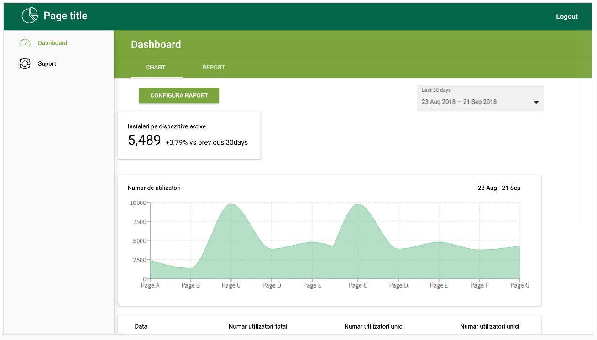
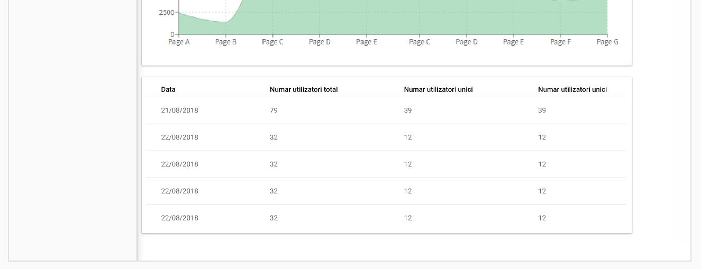
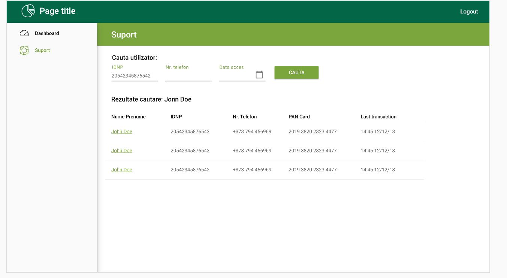

# webFront dev test task - AdminUI

## The task

Create a ReactJS SPA, some typical backend admin UI.

### Requirements:

- Must use the latest ReactJS.
- Mock web-service request as needed. Assume API response delay ranging from 2ms to 15s.
- Use your favorite set of tools.
- We expect best practices in your code.

## The UI

### Charts

Selecting a period from the picker (upper-right portion) should re-populate the “card”, “chart” and “list” parts.

Data should refresh automatically every 10s.

### Search’n’display

UI should allow searching by 3 input fields. After a “search” button is pressed, list items should be re-populated with
API response.

### Misc

- Do not hesitate to ask questions;
- Try to split your work in smaller chunks and create tickets/commits/merges;
- Submit the work AS IS when you think “enough time spent on a test task”;
- Let u know how much time it took you.
